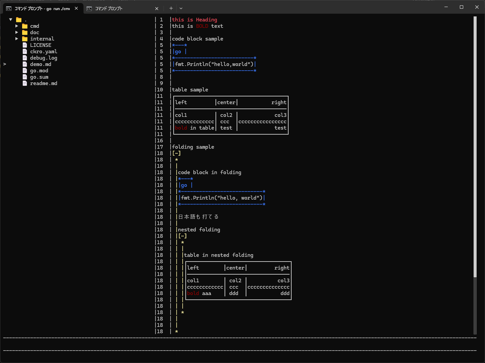

# ckro
ckroはObsidianにインスパイアされた、日記や記事を執筆することにフォーカスしたTUIのマークダウンエディターです。


## How to install
````
go install github.com/desktopgame/ckro/cmd/ckro@latest
````

## How to use
コマンドを実行するとエディターが起動します。
````
ckro
````

オプションで起動ディレクトリを指定できます。
````
ckro -d ./project
````

### Shortcuts
Emacsを踏襲したショートカットを搭載していますが、  
キーバインド地獄を避けるため、操作の多くはコマンドパレットに集約されます。

- Alt+P コマンドパレットの表示
- Shift+Tab フォーカスの移動
- Ctrl+P 上の行へ
- Ctrl+N 下の行へ
- Ctrl+B 前の文字へ
- Ctrl+F 次の文字へ
- Ctrl+A 行頭へ
- Ctrl+E 行末へ
- Ctrl+C 終了

## Configuration
ckro が起動されるディレクトリに設定ファイルを置くことでそちらを読んで動作します。  

```ckro.yaml
ApiKey: lmstudio
BaseUrl: http://localhost:1234/v1
Model: openai/gpt-oss-20b
SystemPrompt: You are friendly assistant.
```

### Vault
.vault ファイルが存在するディレクトリは保管庫として認識されます。  
起動時のディレクトリになくても、親ディレクトリをさかのぼって .vault を発見しようとします。  
